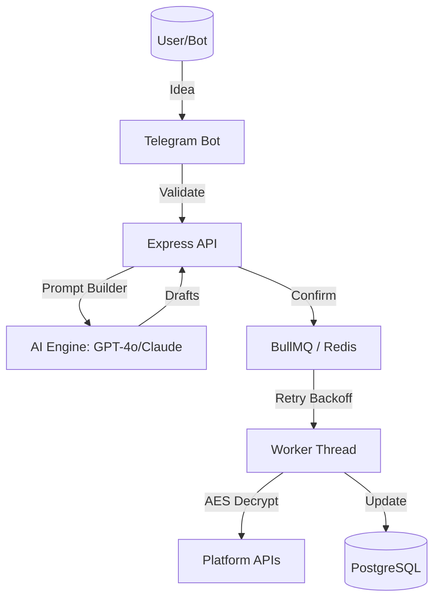

# System Architecture 🏛️

## Data Flow: Idea to Reality

## Core Design Decisions
1. **Redis Session Management**:
   The Telegram bot maintains conversation state in Redis with a 30-minute expiry. This ensures the backend remains stateless while enabling a rich, multi-step UI flow (e.g., "Back" buttons).
   
2. **Partial Failure Strategy**:
   Each platform (Twitter, LinkedIn, etc.) is queued as an **independent BullMQ job**. If Twitter fails, it enters a retry loop (1s -> 5s -> 25s) without affecting the success of the LinkedIn post.

3. **Security & Encryption**:
   Sensitive OAuth tokens and AI keys are encrypted at rest using `AES-256-GCM`. Decryption only happens in the isolated Worker thread milliseconds before the API call.

4. **Telemetry & Observability**:
   We use a Proxy-based tracing system for Redis and a Prisma Extension for DB monitoring. This allows us to track performance bottlenecks in real-time without polluting the business logic.

## Schema Design
- **Posts vs PlatformPosts**: One-to-many relationship allows for different statuses per platform for a single concept.
- **SocialAccounts**: Modular design supporting multiple platform linking per user.
