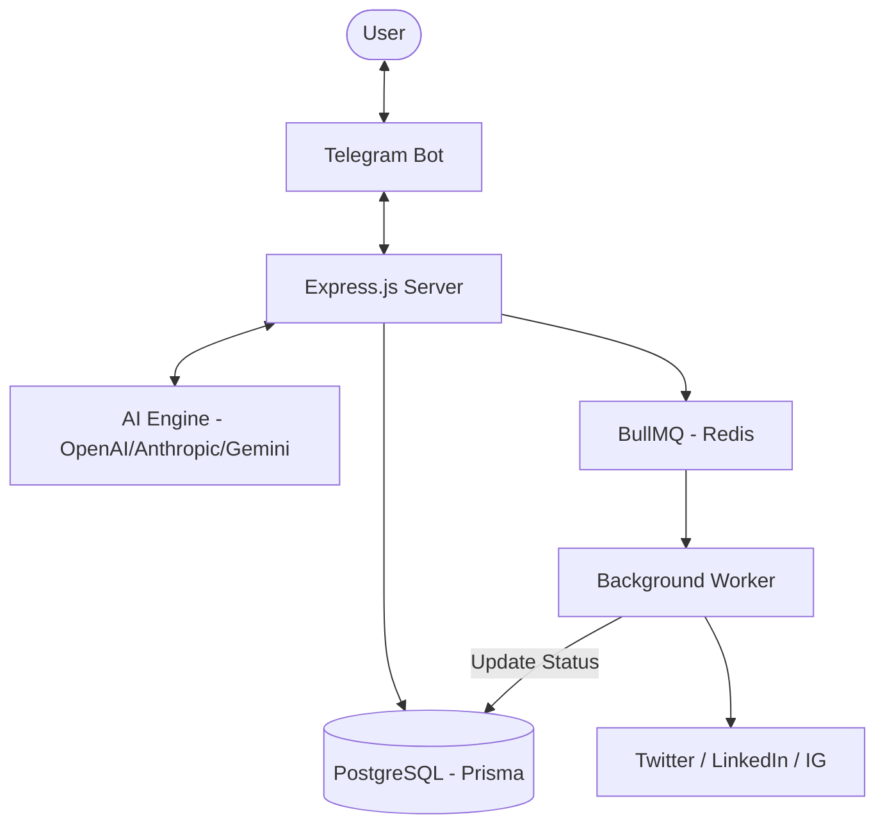

# Postly Engine: System Architecture

Postly is a high-performance, multi-platform AI content publishing engine. This document outlines the technical design, data flow, and architectural decisions made to ensure production-grade reliability.

## 🏗️ High-Level Overview
The system follows a distributed, event-driven architecture using **BullMQ** for reliable background processing and **Redis** for stateful bot conversations.

## 🧠 Core Components

### 1. Conversational Bot (The Interface)
- **State Management**: Built with `grammY`. Post state (platform selections, tone, etc.) is stored in **Upstash Redis** to ensure persistence across server restarts.
- **Webhook Integration**: Configured for low-latency responsiveness in production.

### 2. AI Content Engine (The Brain)
- **Multi-Model Intelligence**: Supports GPT-4o, Claude 3.5, and Gemini 2.5.
- **Platform-Specific Rules**: Strict character limits and formatting (hashtags/emojis) are enforced via a centralized `PromptBuilder`.

### 3. Publishing Pipeline (The Muscle)
- **Resilient Worker**: A dedicated BullMQ worker handles the "Platform API" calls.
- **Partial Failure Handling**: If one platform fails (e.g., LinkedIn API is down), only that specific job is retried, keeping other platform posts unaffected.
- **Retry Policy**: Exponential backoff (1s → 5s → 25s) is enforced for failed publishing attempts.

## 🔐 Security & Operations
- **Encryption at Rest**: Social account OAuth tokens and AI keys are encrypted using **AES-256-CBC** before database storage.
- **JWT Rotation**: Access tokens are short-lived, while Refresh tokens are stored in the database and rotated on every use to prevent reuse attacks.
- **Database**: PostgreSQL (hosted on Supabase) serves as the source of truth for users, posts, and job statuses.

## 🛠️ Tech Stack Decisions
| Layer | Choice | Rationale |
| :--- | :--- | :--- |
| Runtime | Node.js (v24+) | Native ESM support and performance. |
| Database | PostgreSQL | ACID compliance for transaction-heavy publishing. |
| ORM | Prisma | Type-safe schema management and migrations. |
| Queue | BullMQ + Redis | Industry standard for reliable, delayed, and retriable jobs. |
| Auth | JWT | High-security stateless-friendly access with stateful refresh tokens. |
